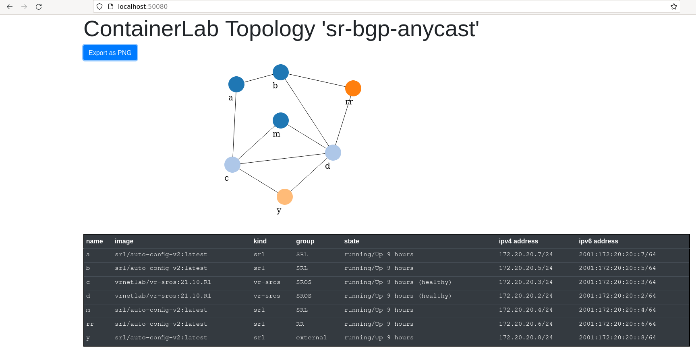

# Automating BGP anycast 🔨 (one next-hop to rule them all 💍)

Ivan was [at it again](https://blog.ipspace.net/2021/12/bgp-multipath-addpath.html) last week, taking his [Netsim tools](https://github.com/ipspace/netsim-tools) to task on a set of virtual nodes to solve a particular issue with sub-optimal routing using the 'addpath' capability ([RFC7911](https://datatracker.ietf.org/doc/html/rfc7911)).

Having read [this](https://blog.ipspace.net/2021/11/anycast-mpls.html) made me wonder if there wasn't another simpler, multi-vendor solution to be explored, one that doesn't require exotic BGP features or prolonged maintenance windows. One that doesn't depend on scarce engineering resources, or hard to get vendor images.



# Installation
Prerequisites: Docker and Containerlab installed

SROS image - see [build instructions](https://containerlab.srlinux.dev/manual/vrnetlab/)
```
git checkout https://github.com/jbemmel/srl-mpls-iot.git
cd srl-mpls-iot/labs/sr-bgp-anycast
sudo containerlab deploy -t ./sr-bgp-anycast.lab
```
Wait until the nodes have booted, then:
```
sudo containerlab config -t ./sr-bgp-anycast.lab -l sr-bgp-anycast -p .
```

## BGP Anycast
Conceptually, an anycast address represents a set of equivalent destinations. It is commonly used in load-balancers and DNS services to direct clients to the 'closest' resource that can satisfy their request. In Ivan's case, if the problem is that the Route Reflector can only advertise one (1) best path per prefix, a potential solution is to use an anycast IP as that single next hop associated with that prefix. That way, nodes in the network can figure out what their locally preferred set of next hops might be.

None of this is particularly new; this [SROS 9.0R1 Advanced Solution Guide from 2011](https://documentation.nokia.com/html/0_add-h-f/93-0267-HTML/7X50_Advanced_Configuration_Guide/BGP_anycast.pdf) described it in great detail for example. That feature applies to MPLS networks with BGP labels and what have you; it creates an active/standby pair of anycast addresses for additional redundancy (which would lead us back to the maximum 1 best path issue...).


